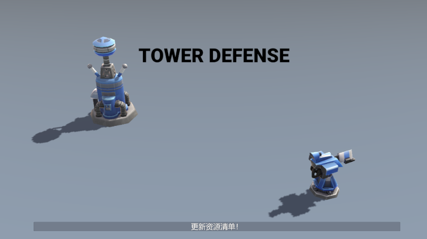
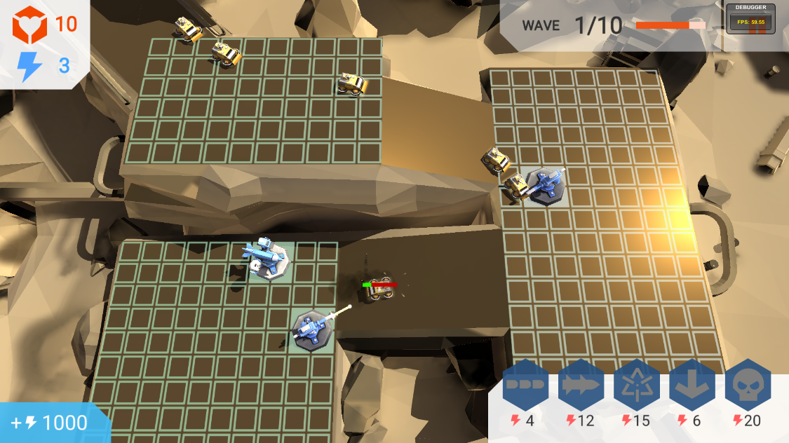
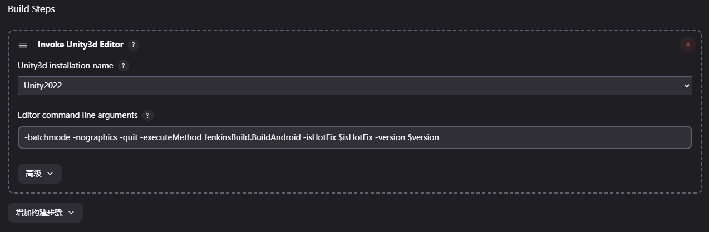
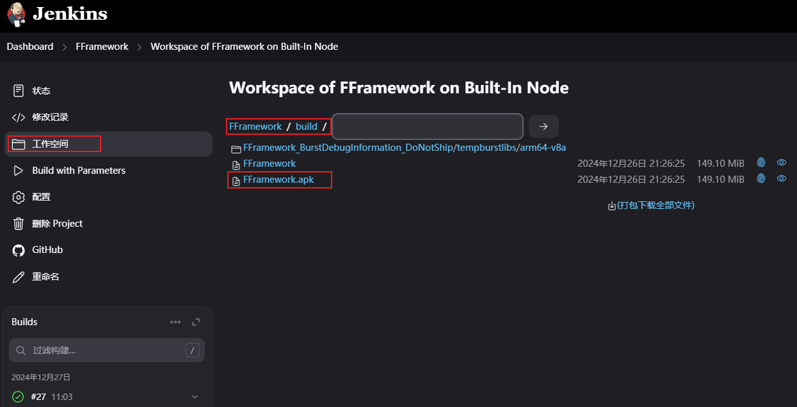
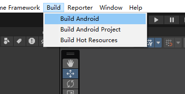

---

## 工程介绍   

此工程热更模块基于 HybridCLR + YooAsset，并将主流的GameFramework修改支持YooAsset。  
并实现，Jenkins自动多渠道打包，白名单灰度测试，一键发布热更资源及版本回退。  

通过这个项目可以了解到：  
（1）框架为项目中提供基础功能，如资源管理、UI框架、网络通信、消息管理、场景管理、数据解析及存取等，同时定义了一系列规范包括编码的，例如参数命名、注释、缩进等  
以及行为准则，例如加载场景必须用框架的xxx接口，贴图必须放在xxx文件夹下等  
（2）性能优化：CPU,GPU,内存   

---

## 项目包含一个完整的小游戏实例  

### 游戏介绍  
基于GameFramework框架实现的塔防游戏，将资源模块改为Addressable，并接入HybridCLR代码热更。  

   
   
   

## 如何让项目运行并实现热更及资源管理  

### HybridCLR编辑器操作
(1)点击执行HybridCLR/Installer打开一个窗体，点击Install等待安装完成  
(2)点击执行HybridCLR/Generate/All, 等待执行完毕    
(3)点击执行HybridCLR/Build/BuildAssetsAndCopyToRes,将Dll生成并拷贝到资源文件夹中   

### 资源管理操作
点击执行YooAsset/AssetBundle Collector，用于管理资源，这里通过成品资源对生资源依赖，进行加载，实现包体内零冗余   
（1）实现了启动场景热更新，在第二次进入游戏时实现更新  
（2）实现了玩家边玩边下载  
（3）玩家自己选择下载关卡内容  
注意：生资源，成品资源路径区分  

### 游戏入口流程
(1)在Main场景下，对资源进行预下载（通过玩家的UID添加白名单测试）    
(2)加载完资源会调用初始化LoadDll,加载热更Dll   
(3)加载完Dll切换热更场景，进入热更模块   

### YooAsset 实现本地模拟
需要利用HFS搭建一个本地服务器，确保手机和电脑处于同一网络，便可实现热更  
[HFS跳转](https://github.com/rejetto/hfs)  

### 其他
(1)Unity 版本使用是2022.3.xx  
(2)基于URP风格化渲染管线  
(3)完善UI框架，及代码自动生成工具  

---

## 框架介绍  

### 框架基于GameFramework  
使用框架的架构思想，并加以改进，如需扩展开发，只需要对GameFramework进行简单了解，可快速实现    

### 渲染基于URP  
基于URP风格化渲染管线（开发中）  
（1）通过判断设备，启动时加载对应的低中高管线  
（2）采用非真实渲染NRP  

### 自动打包流程  

版本发布CI&CD流程：  
CI(Continuous integration持续集成）持续集成强调开发人员提交了新代码之后，立刻进行构建、（单元）测试。  
CD(Continuous Delivery持续交付) 是在持续集成的基础上，将集成后的代码部署到更贴近真实运行环境(类生产环境)中CD(Continuous Delivery持续交付) 是在持续集成的基础上，将集成后的代码部署到更贴近真实运行环境(类生产环境)中。  
Jenkins是开源CI&CD软件领导者， 提供超过1000个插件来支持构建、部署、自动化， 满足任何项目的需要。  
Jenkins[安装教程](https://www.jenkins.io/doc/book/installing/windows/)  
Unity Editor command line arguments[Unity命令参数](https://docs.unity3d.com/2022.3/Documentation/Manual/EditorCommandLineArguments.html)  

（1）支持部署Jenkins，实现自动化打包流程
  
  
-batchmode -nographics -quit -executeMethod JenkinsBuild.BuildAndroid -isHotFix $isHotFix -version $version  
  
  
只需在Jenkins配置相关打包参数，即可实现发布自动化比如：   
isHotFix：（bool 是否热更资源，勾选后只将资源发布到CDN不出包）；  
version：（string 版本号）；  
isLocalPack：(bool git分支验收，将所有资源打入包内)； 

（2）支持在编辑器内一键打包  

  
点击Build Android，即可在工程目录build文件夹下看到FFramework.apk(有可能需要点击两次，第一次点击有可能失败)  
   
---

## FAQ

### 问题
(1)CDN服务器缓存问题，不能及时获取到hash, json（访问根节点耗时太久，改为文件名添加时间戳）   
(2)版本灰度问题，白名单ID问题 （采用后端生成的uid，设备id有权限申请问题）    

### 参考  
代码热更基于[HybridCLR跳转](https://github.com/focus-creative-games/HybridCLR)  
资源热更基于[YooAsset跳转](https://www.yooasset.com/)     