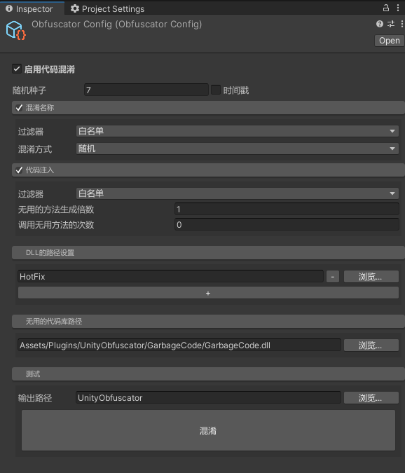

  

选中Plugins/UnityObfuscator/Editor/ObfuscatorConfig，将显示上图，进行相应配置，对HotFix.dll进行混淆。在HybridCLR中不要去混淆AOT的dll.

### 参考  
代码混淆[Unity-Obfuscator跳转](https://github.com/DrFlower/Unity-Obfuscator)  多年未更新，不支持pdb。将其修改为支持，并做对应优化。